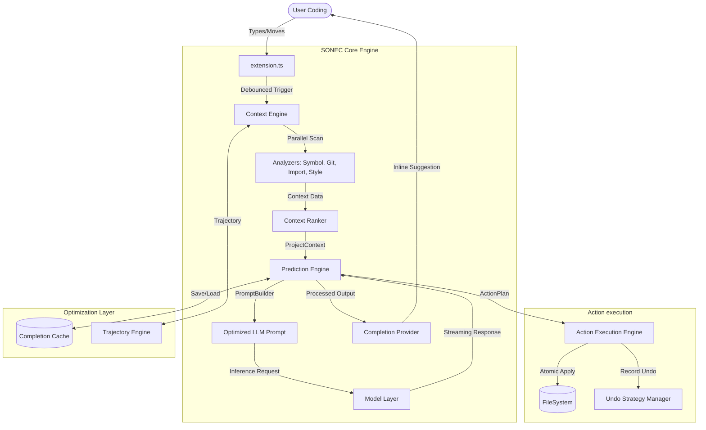

# SONEC Architecture Diagram

This diagram visualizes the data flow and system interactions within the SONEC autonomous coding engine.

## Description

1.  **Trigger Layer**: Monitors VS Code events and manages the activation of the engine.
2.  **Context Layer**: Dynamically resolves the project structure, language symbols, and recent developer history to build a deep understanding of the current task.
3.  **Intelligence Layer**: Orchestrates LLM interactions, streaming results, and calculating speculative edits using trajectory analysis.
4.  **Execution Layer**: Manages complex, multi-file code transformations with high reliability and transaction safety.
