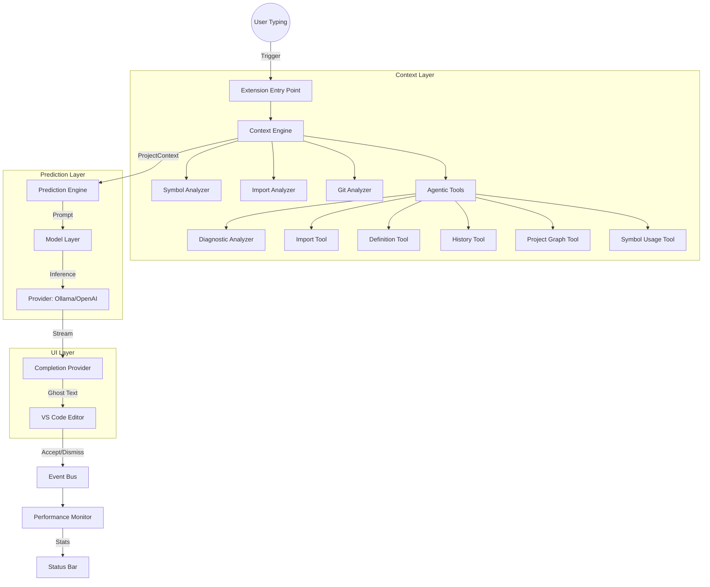

# AutoCode Architecture Diagram

This diagram visualizes the interaction between the core components of the AutoCode engine.

## Component Roles

- **Context Layer**: Aggregates structural and semantic data about the project.
- **Prediction Layer**: Manages the LLM communication and caching.
- **UI Layer**: Handles the rendering of suggestions and user interactions.
- **Feedback Loop**: Tracks metrics to optimize future completions.
